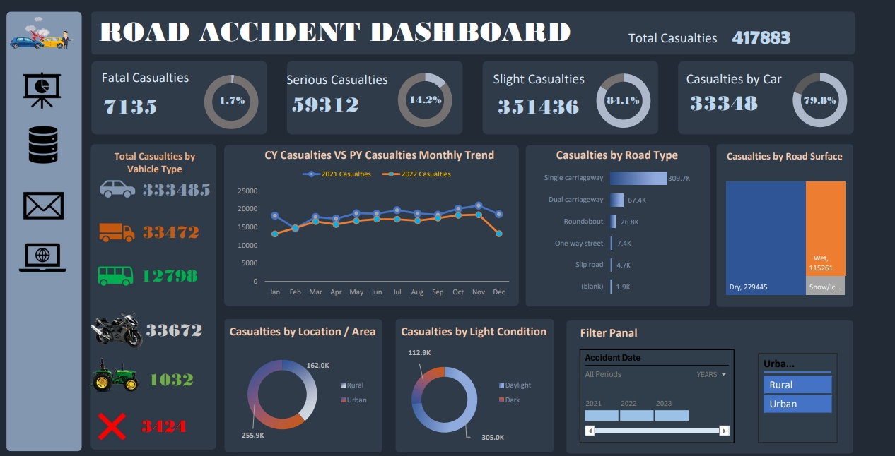

# Interactive Dashboard for Data Analytics

#### **1. Overview**
- **Objective:** Create an interactive Excel dashboard to analyze and visualize data for decision-making.
- **Skills Utilized:** Data cleaning, processing, analysis, visualization, and dashboard creation.
- **Tools Used:** Microsoft Excel.
  
---

#### **2. REQUIREMENT**
Clients want to create a **Road Accident Dashboard** for the years 2021 and 2022 so that they can have insight on the below requirements:

- **Primary KPI**: Total Casualties taken place after the accident  
- **Primary KPIs**: Total Casualties & percentage of total with respect to accident severity and maximum casualties by type of vehicle  
- **Secondary KPIs**: Total Casualties with respect to vehicle type  
- Monthly trend showing comparison of casualties for Current Year and Previous Year  
- Maximum casualties by Road Type  
- Distribution of total casualties by Road Surface  
- Relation between Casualties by Area/Location & by Day/Night  

---

#### **3. Project Scope**
- **Purpose:** To learn and demonstrate end-to-end data analysis and dashboard creation in Excel.
- **Steps Covered:**
  1. Requirement Gathering.
  2. Data Cleaning and Processing.
  3. Data Analysis using Excel functions and Pivot Tables.
  4. Visualization using charts.
  5. Interactive Dashboard creation with slicers and filter panels.

---

#### **4. Workflow**
1. **Requirement Gathering**
   - Identified project requirements based on client needs.
   - Determined key stakeholders and deliverables.

2. **Data Preparation**
   - **Data Cleaning:** Removed duplicates, handled missing values, and standardized formats.
   - **Data Processing:** Added calculated fields and transformed data as per project needs.

3. **Data Analysis**
   - Used **Pivot Tables** for aggregating data insights.
   - Applied functions like `VLOOKUP`, `HLOOKUP`, `IF`, and conditional formatting.

4. **Data Visualization**
   - Created meaningful charts like bar, pie, and line charts to depict trends and KPIs.
   - Designed custom sheets to highlight key insights.

5. **Dashboard Creation**
   - Built an interactive dashboard with slicers, dynamic charts, and a filter panel.
   - Ensured the dashboard was user-friendly and visually appealing.

---

#### **5. Key Features of the Dashboard**
- **Interactive Filters:** Enabled users to dynamically filter data by category, date, or region.
- **Dynamic Charts:** Updated visuals automatically based on filter selection.
- **KPI Highlights:** Displayed metrics like total sales, growth rate, and category-wise performance.

---

#### **6. Tools and Techniques**
- **Excel Features:**
  - Data Validation.
  - Conditional Formatting.
  - Pivot Tables and Pivot Charts.
  - Slicers and Filters.
- **Formulas Used:**
  - `VLOOKUP`, `HLOOKUP`, `INDEX-MATCH`, `IF`, `SUMIFS`, `COUNTIFS`.
- **Design Techniques:**
  - Use of color coding for better readability.
  - Placement of key metrics for quick insights.

---

#### **7. Challenges and Solutions**
- **Challenge 1:** Cleaning large datasets with inconsistent formats.
  - **Solution:** Used Excel functions and text-to-columns for standardization.
- **Challenge 2:** Making the dashboard intuitive and interactive.
  - **Solution:** Added slicers and grouped related metrics.

---

#### **8. Key Learnings**
- Enhanced knowledge of Excel functions and dashboard design principles.
- Improved understanding of the end-to-end data analysis lifecycle.
- Learned to present data-driven insights in a visually impactful way.

---

#### **9. Outcome**
- Developed a professional, interactive dashboard showcasing analytical insights.
- Practiced real-world data analytics scenarios to enhance problem-solving skills.
- Gained confidence in presenting data for client-ready deliverables.

---

#### **10. Screenshots**
Include:
1. A snapshot of the raw data.
2. Visuals showing data cleaning and processing.
3. The final dashboard with interactive features.

---

#### **11. Next Steps**
- Apply similar techniques to new datasets for diverse industries.
- Explore advanced Excel functions like Power Query and Power Pivot.
- Expand skills to tools like Tableau and Power BI for advanced dashboards.

---
#### **12. Screenshot**

---
#### **13. Link to Project**
- [Google Drive/Project Link](https://drive.google.com/drive/folders/1ARlwFBxFmMDfEzGfu0ksU2NJuEJhmDZs?usp=drive_link)
- [GitHub Repository ](https://github.com/praks7v/Intractive-Dashboard-for-Data-Analysis)

#### **14. Conclusion**
This project demonstrates my ability to handle data analysis and dashboard creation in Excel, making me proficient in end-to-end analytics workflows.

---
